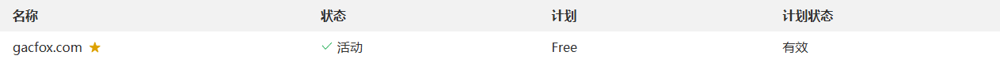
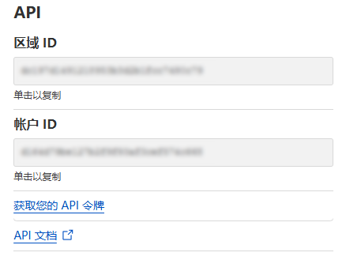

# cloudflare-ddns

基于CloudFlare的DNS解析服务和API实现IPv4、IPv6的DDNS支持，支持Windows和Linux操作系统。

## 使用

### Cloudflare配置

使用前，首先需要有个自己的域名，并在Cloudflare的DNS解析控制台配置站点。



在站点配置页面中找到`区域ID`、`API令牌`：



* `区域ID（ZONE_ID）`：可在Cloudflare控制台`概述`右下角找到
* `API令牌（AUTHORIZATION_KEY）`：可在Cloudflare控制台`概述`右下角创建API令牌，创建时需要配置`区域->DNS`编辑权限

### 编写配置文件

下载工程后，先切换到工程目录创建虚拟环境并安装依赖。

```bash
python -m venv ./venv/ && source venv/bin/activate && pip install -r requirements.txt
```

然后参考`.env.example`创建`.env`配置文件，并填入相关配置。

### 运行工程

执行以下命令运行。

```bash
python sync_ddns.py
```

执行以下命令在后台运行。

```bash
nohup python3 sync_ddns.py > ddns.log &
```

## 配置说明

**ZONE_ID**：从Cloudflare控制台获取。

**AUTHORIZATION_KEY**：从Cloudflare控制台获取。

**NETWORK_INTERFACE**：读取IP的网络接口名，Linux下用`ip addr`或`ifconfig`命令查看，可能为`eth0`、`ens33`等；Windows下用`ipconfig`命令查看，可能为`以太网 1`等类似的名字。

**DOMAIN_NAMES**：需要更新的域名，多个用逗号分隔（不要加空格）。

**IPV4_DDNS**：是否启用IPv4的DDNS。

**IPV6_DDNS**：是否启用IPv6的DDNS。

**UPDATE_INTERVAL_SECONDS**：更新时间间隔（单位为秒）。

## 注意事项

该脚本的执行流程是读取配置文件的`DOMAIN_NAMES`，检查Cloudflare控制台的DNS解析功能是否配置了该域名，如果未配置则添加DNS记录，如果已配置且本机IP发生了变化则更新DNS记录，脚本不会删除任何已配置的DNS记录。
